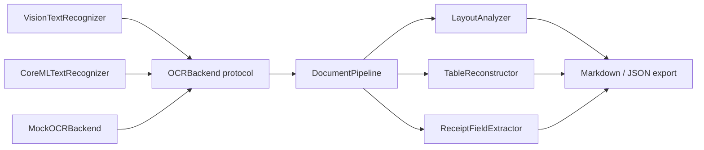

# YomiKit

[English](README.md) | [中文](README.zh.md) | [日本語](README.ja.md)

 [](LICENSE) [](CHANGELOG.md) [](https://github.com/JaydenCJ/yomikit/issues) 

**iOS / macOS で動くオープンソースの on-device 日本語ドキュメント OCR ツールキット。縦書き・レシート・表に対応し、完全オフラインで動作します。**


```bash
git clone https://github.com/JaydenCJ/yomikit.git && cd yomikit && swift build
```

## なぜ YomiKit なのか

精度の高い日本語ドキュメント OCR は今のところサーバーサイドの Python に集中しています。app が iPhone 上で動く場合、レシートや契約書を端末の外に送信せざるを得ません。Apple Vision は端末内で日本語の文字を認識できますが、汎用 OCR のため、縦書きの列を右から左に並べ替えることも、表構造を復元することも、レシートを構造化フィールドに変換することもしません。YomiKit はこの欠けた部分を埋める Swift Package です。任意のエンジンの OCR 結果を受け取り、正しい読み順のテキスト・構造化された表・型付きのレシートデータを、すべて端末内で生成します。

|  | YomiKit | yomitoku | Apple Vision |
|---|---|---|---|
| iOS/macOS の端末内で動作 | yes | no (Python, server-side) | yes |
| 文字認識エンジン | pluggable (Apple Vision default / your Core ML model) | built-in models | built-in |
| 縦書き（tategaki）の読み順 | yes | yes | no |
| 表構造の出力 | yes | yes | no |
| レシート項目抽出を内蔵 | yes | no | no |
| 配布形態 | Swift Package | pip (Python) | OS built-in framework |

## 特徴

- **完全オフライン** — 認識も構造化も端末内で完結します。ネットワーク通信・テレメトリ・アップロードは一切ありません。
- **縦書きを正しく読む** — 投影ギャップに対する再帰 XY-cut により、縦書きの列は右から左へ、段組は上から下へ並びます。
- **レシートがデータになる** — 店名、日付（和暦対応）、時刻、明細行、小計/合計、税率別の税額行（8% 軽減 / 10%）、お預り・お釣りを抽出します。
- **罫線なしでも表を復元** — bounding box だけから行・列の整列を推定してグリッドを再構築します。結合セルにも対応しています。
- **自分のモデルを持ち込める** — Apple Vision は設定なしでそのまま使えます。Core ML ローダー・CTC デコーダー・変換/蒸留スクリプト（小さなランダム重みモデルでエンドツーエンドに実行済み、契約はテストで固定）で独自の認識モデルも組み込めます。
- **コアは Linux でテスト可能** — 解析ロジックはすべて `OCRBackend` protocol の背後にある純粋な Swift で、決定的な mock を備えているため、パイプライン全体を Linux 上でそのまま実行できます。

## クイックスタート

1. リポジトリをクローンし、そのままビルドするか、`Package.swift` にローカルパス依存として追加します:

```bash
git clone https://github.com/JaydenCJ/yomikit.git && cd yomikit && swift build
```

```swift
// yomikit の隣にチェックアウトしたプロジェクトの Package.swift で:
.package(path: "../yomikit")
```

最初の version tag の公開後は、依存の記述は `.package(url: "https://github.com/JaydenCJ/yomikit.git", from: "0.1.0")` になります。

2. 認識済みのレシート行から構造化データを抽出します。このコードは Linux を含むあらゆるプラットフォームで動きます:

```swift
import YomiKitCore

let receipt = ReceiptFieldExtractor().extract(fromLines: [
    "スーパーマルヤマ 川崎店",
    "2026年7月8日(火) 18:42",
    "おにぎり ツナマヨ ¥138",
    "合計 ¥138",
])
print(receipt.storeName!, receipt.date!.isoString, receipt.total!)
```

出力:

```text
スーパーマルヤマ 川崎店 2026-07-08 138
```

3. iOS/macOS では画像から直接処理できます（Apple プラットフォーム限定。デフォルトは Apple Vision）:

```swift
import YomiKit

let scanner = YomiScanner()
let receipt = try await scanner.receipt(in: cgImage)
let layout = try await scanner.document(in: cgImage)   // tategaki-aware
let table = try await scanner.table(in: cgImage)
```

YomiKit に**モデルの重みは含まれていません**。認識器そのものも持ちません — 文字認識は選択したバックエンドが行い、YomiKit はその生の認識結果を構造に変換します。デフォルトのバックエンドは OS 内蔵の Apple Vision のため、そのままの認識精度は Vision の精度です。YomiKit は Vision に欠けている読み順・表・レシート項目を補います。正直な注意点として、縦書きの並べ替えロジックは決定的な列 fixture で検証済みですが、実際に撮影した縦書きページをバックエンドがどう*分割*するかは環境によって異なります。リリース前に対象 OS で検証してください（実機検証スイートを roadmap に掲げています）。

独自の認識モデルを使う場合は、まず [`tools/convert_recognizer.py`](tools/README.md) で変換します。変換・蒸留スクリプトは小さなランダム重みモデルでエンドツーエンドに実行済みで、出力フォーマットはテストで固定されています。生成された 2 つのファイルを次のように読み込みます:

```swift
let vocab = try RecognizerVocabulary(contentsOf: vocabJSONURL)  // <output>-vocab.json
let recognizer = try await CoreMLTextRecognizer(
    modelAt: mlpackageURL,                                      // <output>.mlpackage
    configuration: .init(vocabulary: vocab)
)
let scanner = YomiScanner(recognizer: recognizer)
```

認識の前に、縦長の縦書き列クロップは 90° 回転されます（`Configuration.verticalRegionHandling` を参照）。回転した列画像で学習した横書き CTC モデルでも縦書きテキストを読めるようにするためです。

## アーキテクチャ



2 つの target を明確な境界で分けています。`YomiKitCore` は純粋な Swift（幾何、クラスタリング、読み順、項目抽出、エクスポート）で、どのプラットフォームでもコンパイルできます。`YomiKit` は `#if canImport(...)` ガードで囲まれた薄い Apple レイヤー（Vision / Core ML）です。`OCRBackend` protocol より下流はすべて決定的なロジックで、`MockOCRBackend` でテストしています。

## 開発

```bash
# run the full test suite on Linux (Docker)
docker run --rm -v "$PWD:/src" -w /src swift:6.0.3 swift test

# or natively on macOS 13+ / any machine with a Swift 6 toolchain
swift test

# offline smoke checks (structure + core test subset)
bash scripts/smoke.sh
```

直近の実行（swift:6.0.3 コンテナ、2026-07-08）: `Executed 89 tests, with 0 failures (0 unexpected)`。`bash scripts/smoke.sh` は `SMOKE OK` で終了します。

## ロードマップ

- [x] レイアウト解析（縦書き + 横書き）、表の再構築、レシート抽出、mock でテストされたエンドツーエンドのパイプライン
- [ ] 実機検証スイート：撮影した縦書きページとレシートに対する Vision / Core ML バックエンドの挙動（Apple レイヤーは現在 API 契約レベルの検証のみ）
- [ ] 変換済み日本語認識モデルのリファレンス版（リポジトリには同梱せず別配布）
- [ ] 手書き文字認識への対応
- [ ] 請求書・名刺の項目抽出
- [ ] iOS スキャナーのサンプル app

全体は [open issues](https://github.com/JaydenCJ/yomikit/issues) を参照してください。

## コントリビューション

コントリビューションを歓迎します。まずは [good first issue](https://github.com/JaydenCJ/yomikit/issues?q=is%3Aissue+is%3Aopen+label%3A%22good+first+issue%22) から、または [Issues](https://github.com/JaydenCJ/yomikit/issues) でお気軽にどうぞ。

## ライセンス

[MIT](LICENSE)
