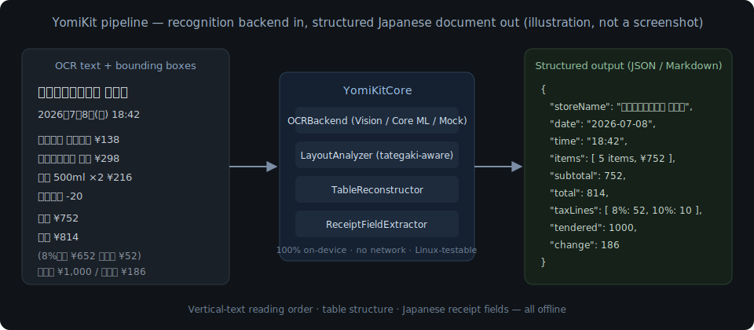
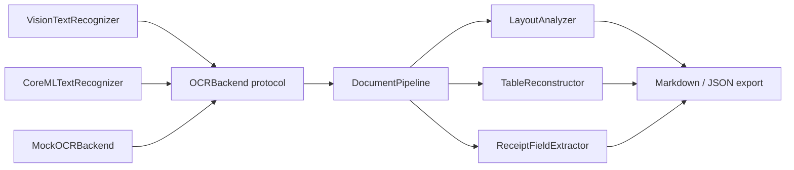

# YomiKit

[English](README.md) | [中文](README.zh.md) | [日本語](README.ja.md)

 [](LICENSE) [](CHANGELOG.md) [](https://github.com/JaydenCJ/yomikit/issues) 

**Open-source, on-device Japanese document OCR toolkit for iOS/macOS — vertical text, receipts, tables, fully offline.**



```bash
git clone https://github.com/JaydenCJ/yomikit.git && cd yomikit && swift build
```

## Why YomiKit?

The best Japanese document OCR lives in server-side Python — if your app runs on an iPhone, your users' receipts and contracts have to leave the device. Apple Vision recognizes Japanese characters on-device, but it is a generic OCR: it does not order vertical (tategaki) columns right-to-left, does not reconstruct table structure, and does not turn a receipt into fields. YomiKit is the missing piece: a Swift package that takes OCR observations from any engine and produces reading-ordered text, structured tables, and typed receipt data — entirely on-device.

|  | YomiKit | yomitoku | Apple Vision |
|---|---|---|---|
| Runs on-device on iOS/macOS | yes | no (Python, server-side) | yes |
| Text recognition engine | pluggable (Apple Vision default / your Core ML model) | built-in models | built-in |
| Vertical-text (tategaki) reading order | yes | yes | no |
| Table structure output | yes | yes | no |
| Built-in receipt field extraction | yes | no | no |
| Distribution | Swift Package | pip (Python) | OS built-in framework |

## Features

- **Fully offline** — recognition and structuring run on the device; no network calls, no telemetry, nothing uploaded.
- **Vertical text done right** — tategaki columns are read right-to-left and stacked sections top-to-bottom, via a recursive XY-cut over projection gaps.
- **Receipts become data** — store name, date (wareki era aware), time, line items, subtotal/total, per-rate tax lines (8% reduced / 10%), tendered and change.
- **Tables without ruling lines** — row/column alignment inference reconstructs the grid from bounding boxes alone, including spanning cells.
- **Bring your own model** — Apple Vision works with zero setup; a Core ML loader, a CTC decoder and conversion/distillation scripts (exercised end-to-end against a tiny random-weight model, contract pinned by tests) let you plug in a custom recognizer.
- **Linux-testable core** — all analysis is pure Swift behind an `OCRBackend` protocol with a deterministic mock, so the full pipeline runs on plain Linux.

## Quickstart

1. Clone the repository, then either build in place or add the package to your `Package.swift` as a local path dependency:

```bash
git clone https://github.com/JaydenCJ/yomikit.git && cd yomikit && swift build
```

```swift
// in the Package.swift of a project checked out next to yomikit:
.package(path: "../yomikit")
```

Once the first version tag is published, the dependency becomes `.package(url: "https://github.com/JaydenCJ/yomikit.git", from: "0.1.0")`.

2. Extract structured data from recognized receipt lines — this exact code runs on any platform, including Linux:

```swift
import YomiKitCore

let receipt = ReceiptFieldExtractor().extract(fromLines: [
    "スーパーマルヤマ 川崎店",
    "2026年7月8日(火) 18:42",
    "おにぎり ツナマヨ ¥138",
    "合計 ¥138",
])
print(receipt.storeName!, receipt.date!.isoString, receipt.total!)
```

Output:

```text
スーパーマルヤマ 川崎店 2026-07-08 138
```

3. On iOS/macOS, go straight from an image (Apple platforms only; uses Apple Vision by default):

```swift
import YomiKit

let scanner = YomiScanner()
let receipt = try await scanner.receipt(in: cgImage)
let layout = try await scanner.document(in: cgImage)   // tategaki-aware
let table = try await scanner.table(in: cgImage)
```

YomiKit ships **no model weights** and no recognizer of its own — character recognition comes from the backend you pick, and YomiKit turns the backend's raw observations into structure. The default backend is Apple Vision (built into the OS), so out of the box recognition accuracy is Vision's, and YomiKit adds what Vision lacks: reading order, tables, receipt fields. One honest caveat: the tategaki ordering is verified against deterministic column fixtures, but how well a given backend *segments* a photographed vertical page varies — validate it on your target OS before shipping (this is on the roadmap as a real-device test suite).

To use a custom recognition model instead, convert it with [`tools/convert_recognizer.py`](tools/README.md) — the conversion and distillation scripts are exercised end-to-end against a tiny random-weight model, and the exact files they emit are pinned by tests — then load the pair it produces:

```swift
let vocab = try RecognizerVocabulary(contentsOf: vocabJSONURL)  // <output>-vocab.json
let recognizer = try await CoreMLTextRecognizer(
    modelAt: mlpackageURL,                                      // <output>.mlpackage
    configuration: .init(vocabulary: vocab)
)
let scanner = YomiScanner(recognizer: recognizer)
```

Tall tategaki column crops are rotated a quarter turn before recognition (see `Configuration.verticalRegionHandling`), so a horizontal CTC model trained on rotated columns can read vertical text.

## Architecture



Two targets with a hard boundary: `YomiKitCore` is pure Swift (geometry, clustering, reading order, extraction, export) and compiles everywhere; `YomiKit` is the thin Apple layer (Vision / Core ML) behind `#if canImport(...)` guards. Everything downstream of the `OCRBackend` protocol is deterministic logic, tested against `MockOCRBackend`.

## Development

```bash
# run the full test suite on Linux (Docker)
docker run --rm -v "$PWD:/src" -w /src swift:6.0.3 swift test

# or natively on macOS 13+ / any machine with a Swift 6 toolchain
swift test

# offline smoke checks (structure + core test subset)
bash scripts/smoke.sh
```

Latest run (swift:6.0.3 container, 2026-07-08): `Executed 89 tests, with 0 failures (0 unexpected)`; `bash scripts/smoke.sh` ends with `SMOKE OK`.

## Roadmap

- [x] Layout analysis (vertical + horizontal), table reconstruction, receipt extraction, mock-tested end-to-end pipeline
- [ ] Real-device validation suite: Vision / Core ML backends on photographed tategaki pages and receipts (the Apple layer is currently verified at the API-contract level only)
- [ ] Reference converted Japanese recognition model (published separately, never bundled in the repo)
- [ ] Handwriting recognition support
- [ ] Invoice (請求書) and business-card field extraction
- [ ] Example iOS scanner app

See the [open issues](https://github.com/JaydenCJ/yomikit/issues) for the full list.

## Contributing

Contributions are welcome — start with a [good first issue](https://github.com/JaydenCJ/yomikit/issues?q=is%3Aissue+is%3Aopen+label%3A%22good+first+issue%22) or open an [issue](https://github.com/JaydenCJ/yomikit/issues).

## License

[MIT](LICENSE)
