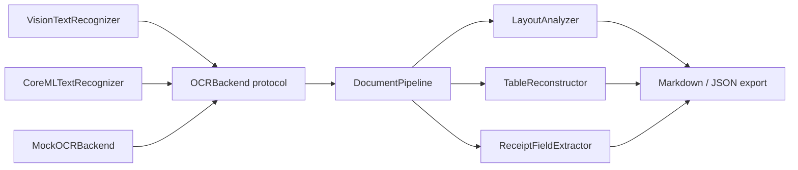

# YomiKit

[English](README.md) | [中文](README.zh.md) | [日本語](README.ja.md)

 [](LICENSE) [](CHANGELOG.md) [](https://github.com/JaydenCJ/yomikit/issues) 

**开源的 on-device 日语文档 OCR 工具包，面向 iOS/macOS——竖排、收据、表格，完全离线。**


```bash
git clone https://github.com/JaydenCJ/yomikit.git && cd yomikit && swift build
```

## 为什么是 YomiKit？

高质量的日语文档 OCR 目前都在服务器端的 Python 里——如果你的 app 跑在 iPhone 上，用户的收据和合同就必须离开设备。Apple Vision 可以在端上识别日文字符，但它是通用 OCR：不会把竖排（tategaki）的列按从右到左排序，不会重建表格结构，也不会把收据变成结构化字段。YomiKit 补上了这块缺口：一个 Swift 包，接收任意引擎的 OCR 观测结果，输出阅读顺序正确的文本、结构化表格和带类型的收据数据——全部在端上完成。

|  | YomiKit | yomitoku | Apple Vision |
|---|---|---|---|
| 在 iOS/macOS 端上运行 | yes | no (Python, server-side) | yes |
| 文字识别引擎 | pluggable (Apple Vision default / your Core ML model) | built-in models | built-in |
| 竖排（tategaki）阅读顺序 | yes | yes | no |
| 表格结构输出 | yes | yes | no |
| 内置收据字段抽取 | yes | no | no |
| 分发方式 | Swift Package | pip (Python) | OS built-in framework |

## 特性

- **完全离线** —— 识别和结构化都在设备上运行；无网络请求、无遥测、零上传。
- **竖排排版做对了** —— 通过投影间隙上的递归 XY-cut，竖排列从右到左阅读、上下分段（"段组"）从上到下排序。
- **收据变成数据** —— 店名、日期（支持和历年号）、时间、明细行、小计/合计、按税率区分的税额行（8% 轻减 / 10%）、实收与找零。
- **无框线也能重建表格** —— 仅凭 bounding box 做行列对齐推断即可还原网格，包括跨行跨列的单元格。
- **可接入自己的模型** —— Apple Vision 零配置即用；Core ML 加载器、CTC 解码器和转换/蒸馏脚本（已用微型随机权重模型端到端跑通，契约由测试锁定）支持接入自定义识别模型。
- **核心可在 Linux 测试** —— 全部分析逻辑是 `OCRBackend` 协议之后的纯 Swift，配确定性 mock，整条 pipeline 可以直接在 Linux 上跑。

## 快速开始

1. 克隆本仓库，然后在目录内直接构建，或在你的 `Package.swift` 中以本地路径方式引入依赖：

```bash
git clone https://github.com/JaydenCJ/yomikit.git && cd yomikit && swift build
```

```swift
// 在与 yomikit 同级检出的项目的 Package.swift 中：
.package(path: "../yomikit")
```

首个 version tag 发布后，依赖写法为 `.package(url: "https://github.com/JaydenCJ/yomikit.git", from: "0.1.0")`。

2. 从已识别的收据文本行中抽取结构化数据——这段代码在任何平台上都能运行，包括 Linux：

```swift
import YomiKitCore

let receipt = ReceiptFieldExtractor().extract(fromLines: [
    "スーパーマルヤマ 川崎店",
    "2026年7月8日(火) 18:42",
    "おにぎり ツナマヨ ¥138",
    "合計 ¥138",
])
print(receipt.storeName!, receipt.date!.isoString, receipt.total!)
```

输出：

```text
スーパーマルヤマ 川崎店 2026-07-08 138
```

3. 在 iOS/macOS 上可以直接从图像开始（仅 Apple 平台；默认使用 Apple Vision）：

```swift
import YomiKit

let scanner = YomiScanner()
let receipt = try await scanner.receipt(in: cgImage)
let layout = try await scanner.document(in: cgImage)   // tategaki-aware
let table = try await scanner.table(in: cgImage)
```

YomiKit **不包含任何模型权重**，自身也没有识别器——文字识别来自你选择的后端，YomiKit 负责把后端的原始观测结果变成结构。默认后端是系统内置的 Apple Vision，因此开箱即用的识别精度就是 Vision 的精度，YomiKit 补上 Vision 缺失的部分：阅读顺序、表格、收据字段。一个如实的提醒：竖排排序逻辑已用确定性的列 fixture 验证，但具体后端对实拍竖排页的*切分*效果因环境而异——上线前请在目标 OS 上验证（roadmap 中列有真机验证套件一项）。

若要改用自定义识别模型，请先用 [`tools/convert_recognizer.py`](tools/README.md) 转换——转换与蒸馏脚本已用微型随机权重模型端到端跑通，其产物格式由测试锁定——然后加载它产出的这对文件：

```swift
let vocab = try RecognizerVocabulary(contentsOf: vocabJSONURL)  // <output>-vocab.json
let recognizer = try await CoreMLTextRecognizer(
    modelAt: mlpackageURL,                                      // <output>.mlpackage
    configuration: .init(vocabulary: vocab)
)
let scanner = YomiScanner(recognizer: recognizer)
```

识别前，细高的竖排列裁剪会先旋转 90°（见 `Configuration.verticalRegionHandling`），使在旋转列图上训练的横排 CTC 模型也能读出竖排文本。

## 架构



两个 target，边界清晰：`YomiKitCore` 是纯 Swift（几何、聚类、阅读顺序、字段抽取、导出），在任何平台可编译；`YomiKit` 是薄薄的 Apple 层（Vision / Core ML），全部包在 `#if canImport(...)` 守卫内。`OCRBackend` 协议之后的一切都是确定性逻辑，用 `MockOCRBackend` 测试。

## 开发

```bash
# run the full test suite on Linux (Docker)
docker run --rm -v "$PWD:/src" -w /src swift:6.0.3 swift test

# or natively on macOS 13+ / any machine with a Swift 6 toolchain
swift test

# offline smoke checks (structure + core test subset)
bash scripts/smoke.sh
```

最近一次实跑（swift:6.0.3 容器，2026-07-08）：`Executed 89 tests, with 0 failures (0 unexpected)`；`bash scripts/smoke.sh` 以 `SMOKE OK` 结束。

## 路线图

- [x] 版面分析（竖排 + 横排）、表格重建、收据抽取、基于 mock 测试的端到端 pipeline
- [ ] 真机验证套件：Vision / Core ML 后端对实拍竖排页与收据的表现（Apple 层目前仅验证到 API 契约级别）
- [ ] 参考用的日语识别模型转换版（单独发布，绝不打包进仓库）
- [ ] 手写体识别支持
- [ ] 请求书（发票，請求書）与名片字段抽取
- [ ] iOS 扫描示例 app

完整列表见 [open issues](https://github.com/JaydenCJ/yomikit/issues)。

## 参与贡献

欢迎贡献——从 [good first issue](https://github.com/JaydenCJ/yomikit/issues?q=is%3Aissue+is%3Aopen+label%3A%22good+first+issue%22) 入手，或提交 [issue](https://github.com/JaydenCJ/yomikit/issues) 参与讨论。

## 许可证

[MIT](LICENSE)
